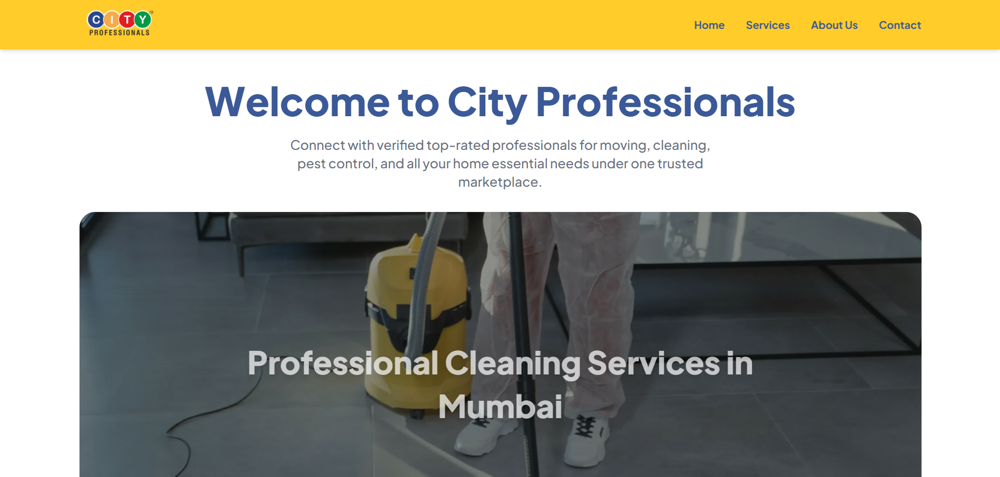

# City Professionals Landing Page

An interactive landing page built for the City Professionals assessment. Features a responsive touch-swipe hero slider, scroll-triggered animations, and an interactive service showcase.



**Live Demo:** https://city-professionals-assessment.netlify.app/

---

## Features

### Hero & Slider
- Full-width hero section with auto-playing, touch-swipeable image slider
- Interactive letter-hover effect on the main heading
- Smooth cross-fade transition between slides
- Responsive layout that adapts to mobile, tablet, and desktop

### Services & UI
- Service showcase with Lottie-based motion graphics
- Interactive cards that trigger animation on mouse hover
- Scroll-triggered entrance animations using Framer Motion
- Fully responsive callback request form
- Footer with professional links and contact info

### Performance
- WebP optimized images for faster loading
- Vite build tooling for fast development and optimized production builds
- Lazy loading and code splitting out of the box

---

## Tech Stack

| Layer | Technology |
|-------|-----------|
| Frontend | React, Vite, Tailwind CSS |
| Animations | Framer Motion, Lottie-React |
| Language | TypeScript |
| Deployment | Netlify |
| Assets | WebP optimized images |

---

## Setup Steps

### Requirements
- Node.js 18+
- npm

### Installation

**1. Clone the repository**
```bash
git clone https://github.com/tiin-tiin/cityprofessionals-landingpage.git
cd cityprofessionals-landingpage/frontend
```

**2. Install dependencies**
```bash
npm install
```

**3. Start the development server**
```bash
npm run dev
```

**4. Build for production**
```bash
npm run build
```

**5. Preview production build**
```bash
npm run preview
```

---

## Project Structure

```
cityprofessionals-landingpage/
├── backend/                    # Server-side logic (future expansion)
├── frontend/                   # React application source code
│   ├── src/
│   │   ├── assets/             # WebP images, Lottie JSON animations
│   │   ├── components/         # Hero, Services, Footer UI components
│   │   └── App.tsx             # Application entry point
│   ├── public/                 # Static assets
│   ├── package.json            # Project dependencies
│   └── vite.config.ts          # Vite configuration
└── README.md
```

---

## Deployment

The project is deployed on **Netlify** with continuous deployment from the main branch.

To deploy your own instance:
1. Push the repository to GitHub
2. Connect the repo to Netlify
3. Set the build command to `npm run build`
4. Set the publish directory to `dist`

---

## License & Rights

© 2026 City Professionals. All rights reserved.

Visit the official website at: https://cityprofessionals.in

This project was built as part of the City Professionals developer assessment. All branding, logo, and trademarks belong to City Professionals. This is an assessment submission and not an official City Professionals product.
